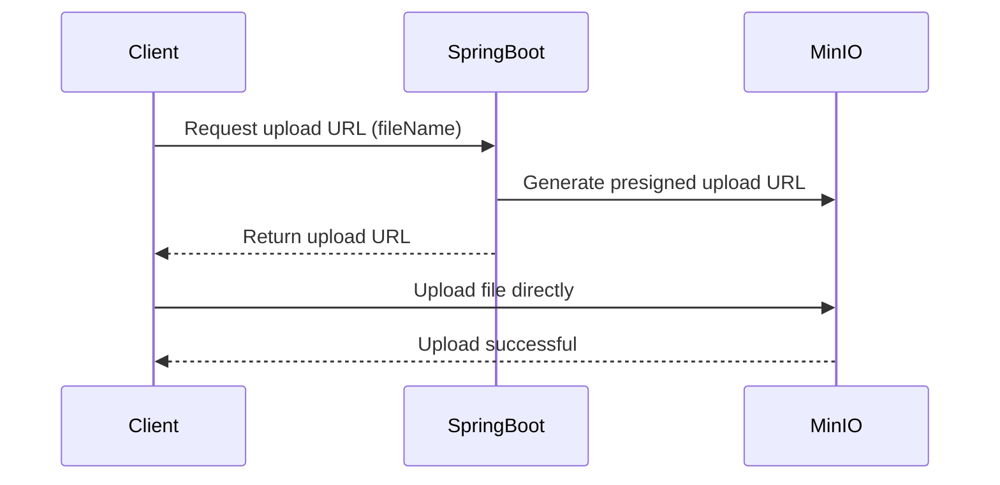
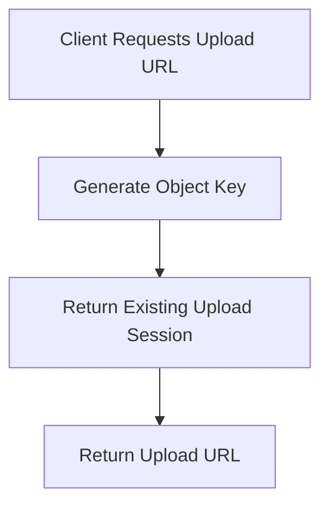
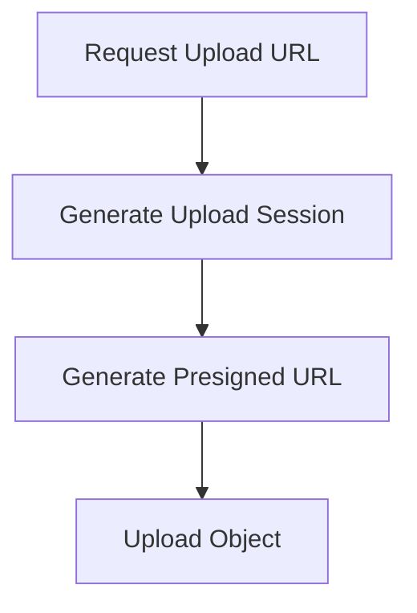
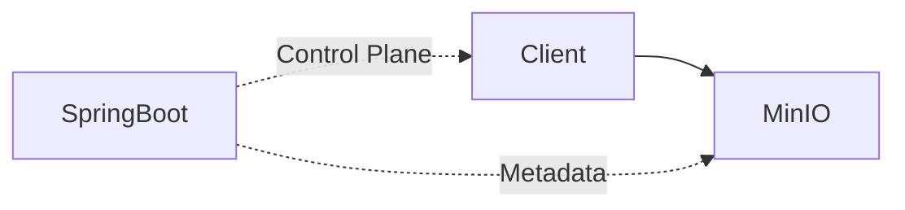

# Spring Boot + MinIO Object Storage

## What is an Object Store?

An object store is a storage system designed for storing files (objects) such as images, videos, PDFs, and documents.

Unlike a traditional filesystem that organizes data using folders and blocks, object storage stores:

* The file data itself
* Metadata about the file
* A unique object key

Example:

```text
Bucket: documents

Object Key:
550e8400-e29b-41d4-a716-446655440000-resume.pdf
```

Popular object storage solutions include:

* Amazon S3
* MinIO
* Google Cloud Storage
* Azure Blob Storage

Object storage is commonly used in modern backend systems because it scales well for large files and high volumes of data.

---

## Why MinIO?

MinIO is a self-hosted, S3-compatible object storage server.

Since MinIO implements the Amazon S3 API, code written against MinIO can later be migrated to AWS S3 with minimal or no business logic changes.

Typical migration involves changing only configuration such as:

```yaml
endpoint
access-key
secret-key
bucket-name
```

This makes MinIO ideal for local development and learning object storage concepts before moving to cloud providers.

---

## Spring Boot Integration

### Dependency

Gradle:

```gradle
implementation 'io.minio:minio:8.5.17'
```

---

### Configuration Properties

```yaml
minio:
  endpoint: http://localhost:9000
  access-key: admin
  secret-key: password123
  bucket-name: documents
```

---

### MinIO Bean Configuration

```java
@Configuration
public class MinioConfig {

    @Bean
    public MinioClient minioClient() {
        return MinioClient.builder()
                .endpoint("http://localhost:9000")
                .credentials("admin", "password123")
                .build();
    }
}
```

The `MinioClient` bean can then be injected into services responsible for uploading, downloading, and deleting objects.

---

## Running MinIO Locally

### Docker Compose

```yaml
services:
  minio:
    image: minio/minio
    command: server /data --console-address ":9001"
    ports:
      - "9000:9000"
      - "9001:9001"
    environment:
      MINIO_ROOT_USER: admin
      MINIO_ROOT_PASSWORD: password123
```

Start MinIO:

```bash
docker compose up -d
```

---

## Why `--console-address ":9001"`?

MinIO exposes:

* Port `9000` → S3 API endpoint
* Port `9001` → Web Console

Without:

```bash
--console-address ":9001"
```

the MinIO web UI is not exposed separately and cannot be accessed via:

```text
http://localhost:9001
```

The web console is useful for:

* Creating buckets
* Uploading test files
* Viewing stored objects
* Managing users and access policies

---

## Accessing MinIO

### S3 API

```text
http://localhost:9000
```

### MinIO Console

```text
http://localhost:9001
```

Credentials:

```text
Username: admin
Password: password123
```

---

## Bucket and Object Terminology

```text
Bucket
 ├── profile.png
 ├── resume.pdf
 └── video.mp4
```

A bucket is similar to a top-level container.

Files are stored as objects inside buckets and are identified by object keys.

Example:

```text
Bucket: documents

Object Key:
9f6c0f1a-0c8a-4d4f-b94d-c83f7fd8d55e-resume.pdf
```

The object key uniquely identifies the stored object within a bucket.

---

## Common Object Operations

### Uploading a Document

To upload a file to MinIO, the application uses:

```java
minioClient.putObject(...)
```

Example:

```java
minioClient.putObject(
    PutObjectArgs.builder()
        .bucket(bucketName)
        .object(objectKey)
        .stream(
            file.getInputStream(),
            file.getSize(),
            -1
        )
        .contentType(file.getContentType())
        .build()
);
```

#### What it does

* Reads the incoming file stream from Spring Boot's `MultipartFile`
* Uploads the file into the specified bucket
* Stores the file under the provided object key
* Persists the object in MinIO's underlying storage

Example:

```text
Bucket: documents

Object Key:
550e8400-e29b-41d4-a716-446655440000-resume.pdf
```

After successful execution, the file is physically stored in the object store and can later be downloaded or deleted.

---

### Generating a Download URL

To allow users to download a file without exposing MinIO credentials, the application generates a presigned URL using:

```java
minioClient.getPresignedObjectUrl(...)
```

Example:

```java
String url = minioClient.getPresignedObjectUrl(
    GetPresignedObjectUrlArgs.builder()
        .method(Method.GET)
        .bucket(bucketName)
        .object(objectKey)
        .expiry(1, TimeUnit.HOURS)
        .build()
);
```

#### What it does

* Creates a temporary URL that grants access to a specific object
* No authentication is required by the user
* The URL automatically expires after the configured duration
* Ideal for file downloads in web applications

Flow:

```text
Browser
    |
    v
Spring Boot
    |
    v
Generates Presigned URL
    |
    v
Browser Downloads Directly From MinIO
```

Benefits:

* Spring Boot does not need to stream large files through the application server
* Reduces backend memory and bandwidth usage
* Works similarly to AWS S3 presigned URLs

---

### Deleting a Document

To remove a stored object, the application uses:

```java
minioClient.removeObject(...)
```

Example:

```java
minioClient.removeObject(
    RemoveObjectArgs.builder()
        .bucket(bucketName)
        .object(objectKey)
        .build()
);
```

#### What it does

* Locates the object using its bucket and object key
* Permanently removes the object from storage
* The object can no longer be downloaded
* Any future presigned URLs referencing the object become invalid

Example:

Before deletion:

```text
documents
 ├── profile.png
 ├── resume.pdf
 └── video.mp4
```

After deleting `resume.pdf`:

```text
documents
 ├── profile.png
 └── video.mp4
```

---

### Summary

| Operation              | Method                                   |
| ---------------------- | ---------------------------------------- |
| Upload a file          | `minioClient.putObject(...)`             |
| Generate download link | `minioClient.getPresignedObjectUrl(...)` |
| Delete a file          | `minioClient.removeObject(...)`          |

These operations closely mirror their AWS S3 equivalents, making migration from MinIO to Amazon S3 straightforward.

--- 

## Metadata Storage with PostgreSQL

The actual file contents are stored in MinIO, while file metadata is stored in PostgreSQL.

This approach keeps the database lightweight and avoids storing large binary files (BLOBs) inside PostgreSQL.

Example entity:

```java
@Entity
public class Document {

    @Id
    @GeneratedValue(strategy = GenerationType.UUID)
    private UUID id;

    private String fileName;

    private String objectKey;

    private Long size;
}
```

### Why Store Metadata Separately?

MinIO is optimized for storing file contents, whereas PostgreSQL is optimized for querying structured data.

The application stores:

* `id` → Unique identifier exposed to clients
* `fileName` → Original filename
* `objectKey` → Internal MinIO object identifier
* `size` → File size in bytes

Example record:

| id          | fileName   | objectKey                          | size   |
| ----------- | ---------- | ---------------------------------- | ------ |
| 550e8400... | resume.pdf | 7b1f9f43-2f6a-4f7a-8a5e-resume.pdf | 245760 |

---

## Upload Flow

When a file is uploaded:

1. Generate a unique object key
2. Upload the file to MinIO using `putObject(...)`
3. Save metadata to PostgreSQL

Flow:

```text
Client
  |
  v
Spring Boot
  |
  +--> Upload File To MinIO
  |         |
  |         v
  |     objectKey
  |
  +--> Save Metadata To PostgreSQL
            |
            v
        Document Record
```

The database never stores the actual file contents.

---

## Listing Documents

The application retrieves document metadata from PostgreSQL.

Example response:

```json
[
  {
    "id": "4a5c2b10-6f76-4f6d-9c2d-4c64d4e90c87",
    "fileName": "resume.pdf",
    "size": 245760
  },
  {
    "id": "d8b7d3a8-8f70-40d7-a84a-d730c6071c21",
    "fileName": "profile.png",
    "size": 102400
  }
]
```

---

## Generating a Download URL

To download a document:

1. Find the document metadata in PostgreSQL
2. Retrieve its `objectKey`
3. Generate a presigned URL using `getPresignedObjectUrl(...)`
4. Return the URL to the client

Flow:

```text
Client
  |
  v
Document ID
  |
  v
PostgreSQL
  |
  v
objectKey
  |
  v
MinIO Presigned URL
  |
  v
Client Downloads File
```

The `objectKey` acts as the bridge between PostgreSQL metadata and the actual object stored in MinIO.

---

## Deleting a Document

To delete a document:

1. Find the document metadata in PostgreSQL
2. Retrieve its `objectKey`
3. Delete the object from MinIO using `removeObject(...)`
4. Delete the metadata record from PostgreSQL

Flow:

```text
Document ID
  |
  v
PostgreSQL
  |
  v
objectKey
  |
  +--> Remove Object From MinIO
  |
  +--> Remove Metadata From PostgreSQL
```

This ensures that neither orphaned files nor orphaned database records remain in the system.

---

## Architecture Overview

```text
                   PostgreSQL
                 +------------+
                 | Document   |
                 | Metadata   |
                 +------------+
                        |
                        | objectKey
                        |
                        v
                    MinIO
                 +------------+
                 | File Data  |
                 +------------+

Metadata  ---> PostgreSQL
File Data ---> MinIO
```

This separation of responsibilities is the same pattern commonly used with Amazon S3 in production systems.

---

### Docker compose setup for MinIO (for object storage) + Postgres (for metadata storage):
Refer to this [docker-compose file](databases-compose.yaml).

---

## Current Iteration: Direct-to-Object-Store Uploads

The previous implementation uploaded files through Spring Boot:

```text
Client
  |
  v
Spring Boot
  |
  v
MinIO
```

While simple, this approach forces the application server to handle every byte of every uploaded file.

For large files, this becomes inefficient because:

* Application memory usage increases
* Network bandwidth is consumed twice
* Upload throughput is limited by the backend service
* Spring Boot becomes a bottleneck

To address this, the current iteration uses **presigned upload URLs**.

---

## Upload Flow

Instead of sending the file itself to Spring Boot, the client first requests permission to upload.

### Step 1: Request Upload Permission

The client sends metadata such as:

```json
{
  "fileName": "resume.pdf"
}
```

Spring Boot:

* Generates a unique object key
* Creates a presigned upload URL
* Stores initial metadata if needed
* Returns the upload URL to the client

### Step 2: Upload Directly to MinIO

The client uploads the file directly to MinIO using the returned URL.

### Step 3: Upload Completes

MinIO stores the object without the file bytes ever passing through Spring Boot.

---

## Architecture



---

## Presigned Upload URLs

A presigned upload URL is a temporary, cryptographically signed URL that grants permission to upload a specific object.

Example:

```text
https://minio.example.com/documents/7b1f9f43-resume.pdf?...signature...
```

The client can upload the file directly to this URL without knowing:

* MinIO credentials
* Access keys
* Secret keys

---

## Idempotency

Upload URL generation is designed to be idempotent.

This means that repeated requests for the same upload operation should not create duplicate objects or inconsistent state.

Conceptually:



The goal is that retries caused by network failures do not accidentally create multiple uploads for the same intended file.

---

## Upload URL Lifetime and Usage

Presigned upload URLs are temporary URLs that grant permission to upload to a specific object key.

Characteristics:

* Scoped to a specific bucket
* Scoped to a specific object key
* Valid only for a limited duration
* Generated for a specific upload session

A common misconception is that presigned upload URLs are inherently single-use.

In reality, MinIO (and Amazon S3) enforce expiration, but they do not automatically enforce one-time usage.

Instead, the application treats each presigned URL as belonging to a single upload session.



This allows the application to:

* Associate uploads with business entities
* Prevent duplicate records
* Track upload progress
* Implement upload lifecycle management

As the system evolves, upload sessions will become the source of truth rather than the presigned URL itself.

---

## Metadata Management

Since Spring Boot no longer receives the uploaded file directly, it cannot obtain information such as:

* Actual file size
* Content type
* Upload completion status

from the incoming request itself.

Instead, metadata is now obtained from the object stored in MinIO after upload completion.

This ensures that metadata reflects the actual stored object rather than what the client claimed during upload initiation.

---

## Benefits of Direct Uploads



Spring Boot becomes a control plane responsible for:

* Authorizing uploads
* Generating presigned URLs
* Managing metadata
* Managing object lifecycle

MinIO becomes responsible for:

* Receiving file bytes
* Storing objects
* Serving downloads

This architecture closely resembles how large-scale systems use Amazon S3 in production.

---

## Future Enhancements

The following capabilities will be added once event-driven processing is introduced through **Kafka**:

* Upload status tracking (`PENDING`, `DONE`)
* Automatic file size population from the uploaded object
* Additional post-upload metadata processing

---

# Kafka Integration Completed (Current Iteration)

The event-driven architecture described in the previous *Future Enhancements* section has now been implemented using Kafka and MinIO bucket notifications.

## Updated Upload Flow

In the current implementation, Spring Boot no longer receives the actual file contents. Instead, it acts as a control plane responsible for authorizing uploads and managing metadata.

### Step 1: Upload Request

The client requests an upload URL by providing only the object path:

```text
<directory>/<directory>/.../<filename>
```

Example:

```text
documents/resumes/resume.pdf
```

Spring Boot:

* Creates a metadata record in PostgreSQL
* Stores known information such as:

  * File name / object path
  * Upload status = `PENDING`
  * Creation timestamps
  * Other business metadata
* Returns a presigned upload URL to the client

At this stage, some information is not yet available because the file has not been uploaded.

Examples:

* Actual file size
* Object metadata generated by MinIO

---

### Step 2: Direct Upload to MinIO

The client uploads the file directly to MinIO using the presigned URL.

```text
Client
  |
  v
MinIO
```

The file bytes never pass through Spring Boot.

---

### Step 3: MinIO Publishes Upload Event

After a successful upload, MinIO publishes an object-created event to Kafka.

```text
MinIO
  |
  v
Kafka
  |
  v
Spring Boot Consumer
```

The Spring Boot Kafka consumer:

1. Receives the upload event.
2. Identifies the corresponding metadata record.
3. Fetches missing object metadata from MinIO.
4. Updates the PostgreSQL record.

Typical updates include:

* Upload status → `UPLOADED`
* Actual file size
* Additional object metadata (if required)

This ensures that the database reflects the state of the object that was actually stored rather than information supplied by the client.

---

## Updated Delete Flow

For deletions, a similar event-driven approach is used.

### Step 1: Delete Request

The client requests deletion of an object.

### Step 2: Object Removed from MinIO

The object is deleted from the bucket.

### Step 3: MinIO Publishes Delete Event

MinIO publishes an object-removed event to Kafka.

### Step 4: Spring Boot Processes Event

The Kafka consumer receives the delete event and removes the corresponding metadata record from PostgreSQL.

```text
MinIO Delete Event
        |
        v
      Kafka
        |
        v
 Spring Boot Consumer
        |
        v
 Delete Metadata Record
```

Only records whose upload status is already `UPLOADED` are expected to participate in this flow.

---

## Architecture Overview

```text
                    Upload Request
                           |
                           v
                      Spring Boot
                           |
                           | Create Metadata
                           v
                      PostgreSQL
                    (Status=PENDING)

                           |
                           v
                Presigned Upload URL
                           |
                           v
                         Client
                           |
                           v
                          MinIO
                           |
               Object Created Event
                           |
                           v
                          Kafka
                           |
                           v
                Spring Boot Consumer
                           |
                           v
                Update Metadata Record
                  (Status=UPLOADED)
```

---

# Next Iteration: Failure Handling and Recovery

While the happy-path workflow is now event-driven and functional, several failure scenarios can be addressed in future iterations to improve reliability and consistency.

Potential enhancements include:

## 1. Upload URL Generated but Upload Never Happens

Scenario:

```text
Metadata Record -> PENDING
Upload URL Issued
Client Never Uploads File
```

Possible solution:

* Scheduled cleanup jobs
* Expiration timestamps on upload sessions
* Automatic transition to `FAILED` or `EXPIRED`

---

## 2. Client Upload Interrupted

Scenario:

```text
Client Starts Upload
Network Failure Occurs
Upload Never Completes
```

Possible solution:

* Upload timeout tracking
* Retry mechanisms
* Automatic cleanup of abandoned upload sessions

---

## 3. MinIO Event Not Delivered

Scenario:

```text
File Uploaded Successfully
Kafka Event Missing
Metadata Remains PENDING
```

Possible solution:

* Periodic reconciliation jobs
* Dead-letter queues (DLQ)
* Event delivery monitoring

---

## 4. Kafka Consumer Failure

Scenario:

```text
Kafka Receives Event
Consumer Crashes Before Processing
```

Possible solution:

* Consumer retries
* Dead-letter topics
* Idempotent event processing

---

## 5. Database Update Failure

Scenario:

```text
Event Received
Metadata Update Fails
```

Possible solution:

* Retry policies
* Transactional processing
* Recovery queues

---

## 6. Delete Event Lost

Scenario:

```text
Object Deleted
Metadata Record Remains
```

Possible solution:

* Periodic consistency checks between MinIO and PostgreSQL
* Scheduled orphan-record cleanup

---

## 7. Duplicate Event Processing

Scenario:

```text
Same Kafka Event Processed Multiple Times
```

Possible solution:

* Idempotent consumers
* Event identifiers
* Deduplication tracking

---

These enhancements would move the system closer to a production-grade, fault-tolerant, event-driven object storage architecture capable of handling network failures, service outages, duplicate events, and eventual consistency concerns.
